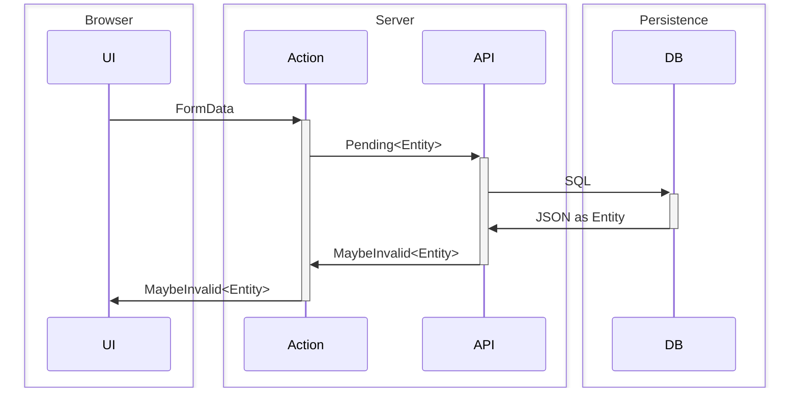

# Instructions for building basic CRUD UI for entities

_The following assumes the latest version of SvelteKit with a Node.js backend and Svelte 5, using runes in the browser._

<dfn><abbr>CRUD</abbr></dfn> stands for create, read, update, and delete of an <dfn>entity</dfn>. If and entity is a noun, CRUD are the basic verbs that can be executed by a user. An example of an entity is a Customer or an Sales Order.

These examples will use the general term `entity`. However, when building out routes or APIs you’d use the actual entity’s name. For example, the `validate_pending_entity()` function would be named `validate_pending_user()` for a User entity.

## Routes

Routes describe the URL structure to access entities. In general, entity CRUD should use HTML forms to `POST` data, extended with SvelteKit’s [`use:enhance`](https://svelte.dev/docs/kit/form-actions#Progressive-enhancement-use:enhance) to avoid a full page reload.

- `/entities`: Lists all of the entities. Uses the English plural name of the entity.
- `/entities/new`: A `GET` request generates an empty form that allows a user to fill in the properties of the entity. The form submits a `POST` request to a `?/create` [form action](https://svelte.dev/docs/kit/form-actions). A successful submission redirects to `/entities/[label]`, making a new request to display the entity. An unscuessful `POST` returns an <dfn>`Invalid&lt;Entity>`</dfn> that provides the pending entity that was submitted along with a collection of validation errors. (See Validation below)
- `/entities/[label]`: A read-only view of the entity instance’s properties. `[label]` is a parameter that maps to an entity’s URL-friendly, unique `label` property.
- `/entities/[label]/edit`: Presents a form view of an entity instance. A `POST` back to this URL with a `?/update` form action. This reuses the validation from `/entities/new?/create`. However, an updated instance will have an <dfn>identifier</dfn>, while a new one won’t. (See Types below.). Finally, you can `POST` to `/entities/[label]?/delete` deletes the entity instance.

## Validation

Every action that updates data must always be validated. Data validation must _never_ throw exceptions. APIs that need convey unsuccessful validation must return `Invalid&lt;PendingEntity, Entity>`. Form actions should test for `Invalid` return types and use SvelteKit `fai()` (i.e. `import { fail } from '@sveltejs/kit';`) to send the `Validation` instance back to the UI. APIs should only throw (or bubble) exceptions for unexpected states that the user cannot fix themselves by submitting different data. For example, an empty value for a required property is a validation error, not an exceptional case. The user should resubmit with a different value. A dropped database connection, on the other hand, is an error state that the user can’t do anything about.



The core `Validation` type. This can be used on the client or the server, so it should live in `$lib/validation.js`.

```javascript
/**
 * @template Out
 */
export class Validation {
	/** @type {Issue[]} */
	#issues = [];
	/**
	 */
	constructor() {}
	/**
	 *
	 * @param {Issue['message']} message
	 * @param {PropertyKey | Path} [property]
	 * @returns {Validation<Out>}
	 */
	add(message, property) {
		// console.log('Validation.add', message, property);
		this.#issues.push({
			message,
			path: property ? [...(Array.isArray(property) ? property : [property])] : []
		});
		return this;
	}
	/**
	 *
	 * @param {Validation<unknown>} validation
	 * @param {Path} [base_path = []]
	 * @returns {Validation<Out>}
	 */
	merge(validation, base_path = []) {
		for (const issue of validation) {
			this.#issues.push({
				message: issue.message,
				path: [...base_path, ...(issue.path ?? [])]
			});
		}
		return this;
	}
	/**
	 * @param {Path | string} [path]
	 * @returns {ReadonlyArray<Issue>}
	 */
	issues(path) {
		if (undefined === path) return this.#issues;
		const _path = 'string' === typeof path ? ('' === path ? [] : [path]) : path;
		return this.#issues.filter((issue) => {
			if (_path.length !== issue.path?.length) return false;
			for (let i = 0; i < _path.length; i++) {
				if (_path[i] !== issue.path?.[i]) return false;
			}
			return true;
		});
	}
	/**
	 *
	 * @param {number} index
	 * @returns {Issue | undefined}
	 */
	at(index) {
		// if (index < 0 || index >= this.#issues.length) return undefined;
		return this.#issues.at(index);
	}
	/**
	 *
	 * @param {Path | string} [path]
	 * @returns {Issue | undefined}
	 */
	first(path) {
		return this.issues(path)[0];
	}
	/**
	 *
	 * @param {Path | string} [path]
	 * @returns {boolean}
	 */
	has(path) {
		return this.issues(path).length > 0;
	}
	/**
	 * Equivalent to calling `validate` on each of the items in the `collection` and
	 * then `merge` on any invalid results. Returns the original `collection` if _any_
	 * of the items is invalid or a collection of the validated items if _all_ of them
	 * are valid.
	 *
	 * TODO: Support other collection types besides `Array`.
	 *
	 * @template In, Out
	 * @param {Array<In>} collection
	 * @template {string} [Prop = "input"]
	 * @param {(item: In) => MaybeInvalid<In, Out, Prop>} validate
	 * @param {Path} [base_path = []]
	 * @returns {Array<In | Out>}
	 */
	collect(collection, validate, base_path = []) {
		let dirty = false;
		const output = collection.map((item, index) => {
			const result = validate(item);
			if (is_invalid(result)) {
				dirty = true;
				this.merge(result.validation, [...base_path, index]);
				return item;
			}
			return result;
		});
		if (dirty) return collection;
		return output;
	}
	/**
	 *
	 * @returns {object}
	 */
	toJSON() {
		return this.#issues;
	}
	/**
	 *
	 * @param {any} json
	 * @returns {Validation<unknown>}
	 */
	static fromJSON(json) {
		return new Validation().merge(json);
	}
	is_valid() {
		return !this.has();
	}
	[Symbol.iterator]() {
		return this.#issues[Symbol.iterator]();
	}
	get length() {
		return this.#issues.length;
	}
	toString() {
		return this.#issues
			.map((issue) => `${issue.message} (${issue.path ? issue.path.join(' > ') : ''})`)
			.join('\n');
	}
}

/**
 * @template In, Out
 * @template {string} [Prop = "input"]
 * @typedef {Invalid<In, Out, Prop>} Invalid
 */

/**
 * @template In, Out
 * @template {string} [Prop = "input"]
 * @typedef {MaybeInvalid<In, Out, Prop>} MaybeInvalid
 */

/**
 * Checks whether a `MaybeInvalid` result is actually `Invalid`.
 * @template In, Out
 * @template {string} [Prop = "input"]
 * @param {MaybeInvalid<In, Out, Prop>} result
 * @returns {result is Invalid<In, Out, Prop>}
 */
export function is_invalid(result) {
	return (
		'object' === typeof result &&
		null !== result &&
		'validation' in result &&
		result.validation instanceof Validation
	);
}
```

Related validation types:

```typescript
/**
 * A validation message. Typical usage is for communicating business rule violations
 * back to users. `for` can optionally reference a property in the entity being validated by name,
 * e.g. `'id'` or `'workloads[3]'`.
 */
export type Issue<Entity = unknown> = {
	readonly message: string;
	readonly path?: Path;
};

export type Path = ReadonlyArray<PropertyKey>;

/**
 * A way to communicate a business rule violation in an API call.
 */
export type Invalid<In, Out, Prop extends string = 'input'> = {
	readonly validation: Validation<Out>;
} & {
	readonly [property in Prop]: In;
};

/**
 * A response to an API call. A response can either be the plain output entity, `Out`,
 * or a validation error wrapper around the input, `In`, plus a collection of `Validation`
 * instances. `Prop` allows you to
 * name the property on the `Invalid` instance to access the input entity,
 * e.g. `result.customer` versus the default, `result.input`.
 *
 * This means that APIs should *not* throw `Error`s for business rule violations.
 * Validation is an expected part of the API contract and thus is modeled in the
 * responses from API calls. Thrown errors should represent exceptional circumstances.
 */
export type MaybeInvalid<In, Out, Prop extends string = 'input'> = Out | Invalid<In, Out, Prop>;
```

In order for SvelteKit to pass strongly typed `Validation` instances between client and server, it needs a `src/hooks.js` configuration:

```javascript
import { Validation } from '$lib/validation';

/** @type {import('@sveltejs/kit').Transport} */
export const transport = {
	Validation: {
		encode: (validation) => validation instanceof Validation && validation.issues(),
		decode: (validation) => Validation.fromJSON(validation)
	}
};
```

## API

All business logic should be implemented in a server-side API, `$lib/server/api.js`. This should export functions

- `list_entities() : Iterable&lt;Entity>`: Gets all of the entity instances as an interable collection (usually an `Array`)
- `get_entity(label: Entity['label']) : Entity | null`: Gets an individual entity by its unique `label` identifier
- `create_entity(input: PendingEntity) : MaybeInvalid&lt;PendingEntity, Entity>`: Submits a pending version of an entity, likely sourced from a `FormData` instance from the UI and returns the proper `Entity` instance or a validation error. (See Types below)
- `update_entity(input: Partial&lt;PendingEntity>) : MaybeInvalid&lt;PendingEntity, Entity>`: Updates an entity instance and returns the validated proper `Entity` instance or a validation error. the `Partial<>` allows the UI to submit a “patch” rather than a full entity instance.
- `delete_entity(instance: Entity['label'] | Array&lt;Entity['label']>) : number | undefined`: Deletes one or more entities by its unique label. This should be atomic, such that all requested entities are deleted or none (and a validation result is returned or `Error` is thrown, such as for a dropped database connection).

## Types

Concrete entities will always have a readonly unique identifier using the braned `ID` type (see definition below). Identifiers should use the singular name of the entity as its property name (e.g. `customer`) and default to UUID v4, generated in the database. They will also have a required `label` property that also uniquely identifies an instance. The `label` is user-configurable, human readable, and URL friendly. It is used as the `[label]` parameter in SvelteKit routes. (See Routes above.)

```typescript
/*** Utilities ***/
declare const IDBrand: unique symbol;
/**
 * Branded type for use as an identifier for an entity. An entity should
 * have exactly one property of this type.
 */
export type ID = string & { [IDBrand]: void };
```

### Pending entities

An HTML form can only express `string` (or `File`) types. This is especially important for references to other entities, i.e. <dfn>foreign keys</dfn>. As a result, a SvelteKit form action with typically submit a “lite” version of an entity with loose `string | null` typeing on properties and `ID` references to related entities. As a result each `Entity` type needs a corresponding `PendingEntity` type. A PendingEntity is characterized by:

- All properties are optional
- All scalar properties can be `string`, `null`, or the original type of the property
- Foreign key references to other entities should use the `ID` type of the referenced entity

(I don’t think it’s possible to make this truly generic, e.g. `Pending&lt;Entity>`.)

## Forms

Entity CRUD should always use regular HTML forms along with SvelteKit’s `use:enhance` to avoid a page load. It’s vitally important to also use ARIA best practices , for example to identify validation errors. The `Control.svelte` is the default implementation of a singl form element. It handles the details of layout, informational help text, and, most importantly, wiring up validation, using the `Validation` class (see definition above).

`$lib/components/Control.svelte`:

```svelte
<script>
	// https://svelte.dev/docs/svelte/svelte-attachments#createAttachmentKey
	import { createAttachmentKey } from 'svelte/attachments';
	import { Validation } from '$lib/validation.js';

	/**
	 * Capitalizes each word
	 * @param {string} str
	 * @returns {string}
	 */
	function title_case(str) {
		// if (null === str || undefined === str) return str;
		if ('string' === typeof str) {
			return str
				.toLowerCase()
				.split(' ')
				.map((word) => word.charAt(0).toUpperCase() + word.slice(1))
				.join(' ');
		}
		throw new TypeError(typeof str);
	}

	/** @type {{name: string, id?: string, label?: string, validation?: Validation<unknown>; value?: unknown, help?: string; input?: import('svelte').Snippet<[Record<string, any>]>}}*/
	let {
		name,
		// svelte-ignore state_referenced_locally
		id = name,
		// svelte-ignore state_referenced_locally
		label = title_case(name),
		validation = new Validation(),
		value,
		help,
		input,
		...other
	} = $props();

	/** @type {Record<string, any>} */
	export const attrs = {
		placeholder: '\u200B', // Prevents weird Safari renering bug with baseline alignment in flexbox
		autocomplete: 'off',
		autocapitalize: 'off',
		spellcheck: 'false'
	};

	// https://svelte.dev/docs/svelte/@attach
	/**
	 * Implments standard HTML custom validity properties. These are used for accessibility and styling (`:invalid`).
     *
	 * @param {Validation<unknown>} validation
	 * @returns {import('svelte/attachments').Attachment<HTMLInputElement | HTMLSelectElement | HTMLTextAreaElement>}
	 */
	function validate(validation) {
		// Returns the attachement function closed over the validation
		return function _validate(element) {
			// console.log('@attach', element.tagName);
			$effect(() => {
				const { name } = element;
				const message = validation?.first(name)?.message ?? '';
				// console.log('$effect', name);
				element.setCustomValidity(message);
			});
			return () => {
				element.setCustomValidity('');
			};
		};
	}
</script>

<div class="control">
	<label for={name}>{label}{label ? ':' : ''}</label>
	<div class="contents">
		{#if input}
			{@render input({
				name,
				id,
				value,
				[createAttachmentKey()]: validate(validation),
				placeholder: attrs.placeholder,
				...other
			})}
		{:else}
			<input
				type="text"
				{id}
				{name}
				{value}
				{@attach validate(validation)}
				aria-invalid={validation?.has(name)}
				aria-errormessage={validation?.has(name) ? `${name}-error` : undefined}
				aria-describedby="{name}-help"
				{...attrs}
				{...other}
			/>
		{/if}
		{#if help}<p class="helper" id={`${name}-help`}>{help}</p>{/if}
		{#if validation?.has(name)}
			<p class="validation" id={`${name}-error`} aria-live="assertive">
				{validation.first(name)?.message}
			</p>
		{/if}
	</div>
</div>

<style>
/*
<!-- Target template: -->
<div class="control">
	<label for="name">Name</label>
	<div class="contents">
		<input type="text" name="name" value={form?.exercise.name} placeholder={'\u200B'} />
		<p class="helper">The name of the exercise</p>
		{#if form?.validation?.has('name')}
			<p class="validation" id="name-error" aria-live="assertive">
				{form?.validation.first('name')?.message}
			</p>
		{/if}
	</div>
</div>
*/
	.control {
		display: flex;
		gap: 1em 2em;
		/* https://www2.webkit.org/show_bug.cgi?id=142968 */
		align-items: baseline;
		margin: 1.5em 0;
	}
	.control .validation,
	.control .helper {
		margin: 0.5rem 0;
		font-size: 0.9em;
		color: var(--color-secondary);
	}
	.validation,
	.control .validation {
		color: var(--color-error);
		font-weight: bolder;
	}
	.control:last-of-type {
		margin-bottom: 0;
	}
	.control label {
		flex-grow: 0;
		flex-shrink: 0;
		flex-basis: 8em;
		text-align: right;
	}
	.control label + * {
		min-width: 10em;
		flex-grow: 1;
	}
	.control .contents > :first-child {
		display: block;
		width: 100%;
	}
</style>
```

A form can provide its own custom input control by passing in a Svelte `snippet`, for example:

```svelte
<Control
	name="description"
	value={form?.exercise.description}
	label="Description"
	validation={form?.validation}
	help="A short summary"
>
	{#snippet input(provided)}
		<textarea {...provided}></textarea>
	{/snippet}
</Control>
```

### Client-side validation

Here‘s an example of a `form` declaration that implements a custom `use:enhance` to provide client-side validation:

```svelte
<form
	novalidate
	method="post"
	action="?/create"
	class:invalid={form?.validation?.has()}
	use:enhance={({ formData, cancel }) => {
		const pending_entity = /** @type {Pending<Entity>} */ ({
			...Object.fromEntries(formData)
		});
		const entity = validate_pending_entity(pending_entity);
		if (is_invalid(entity)) {
			applyAction({
				type: 'failure',
				status: 422,
				data: { validation: entity.validation, entity: pending_entity }
			});
			cancel();
		}
		return; // Inherit default update behavior
	}}
>
	<!-- <Control /> components or any other form HTML go here. -->
</form>
```
